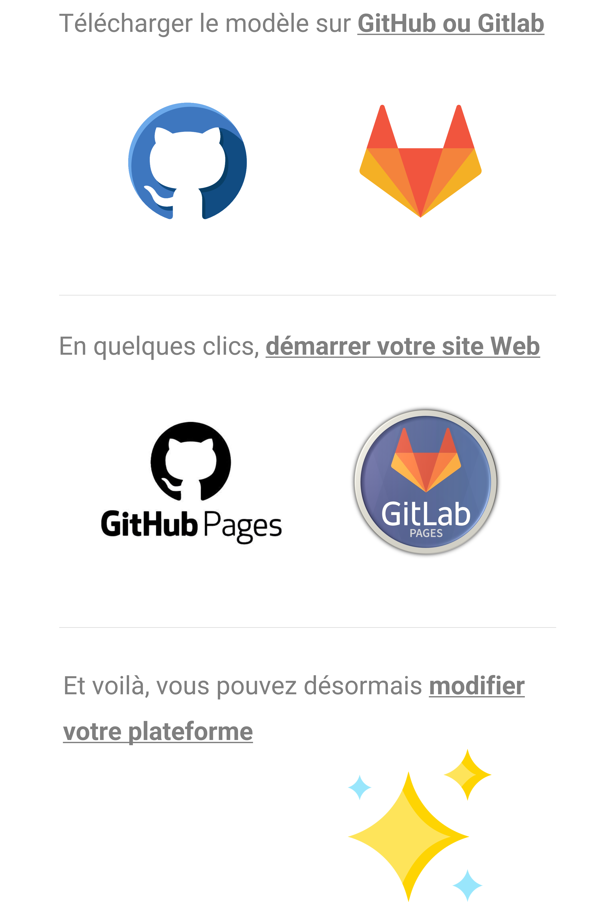

---
hide:
    - toc
    - navigation
---

     
    <h1>Bienvenue sur votre <b>plateforme Katalog</b></h1>
    

    
Accèdez au <u><a href="./etc/biblioteks/home">moteur de recherche</a></u> de vos ressource, ou directement à vos <u><a href="./etc/klouds/home">espaces de stockages</a></u>.

    

        <a href="./etc/biblioteks/home" class="add-card">
            

                 
            

        </a>
        <a href="./etc/klouds/home" class="add-card">
            

                
            

        </a>  
    

      
    

 Mieux comprendre

        

            <h2 style="color:#A5A5A5">Katalog, <b>Kesako ?</b></h2>
              
            

              
            

             
            <h2 style="color:#A5A5A5">Katalog, <b>Pourquoi ?</b></h2>
              
            

            

             
            <h2 style="color:#A5A5A5">Katalog, <b>Comment ?</b></h2>
              
            

        

         
        

            <h2>Comment créer <b>votre propre plateforme Katalog</b> ?</h2>

            <i>Un tutoriel détaillé sera bientôt mis à disposition, affaire à suivre.</i>
              
            <a class="md-button md-button--primary" href="https://konsilion.fr/wp/contacts/" target="_blank">Une plateforme Katalog sur mesure ?</a>
              
        

    

<head>
    <meta charset="utf-8">
    <!--<meta http-equiv="X-UA-Compatible" content="IE=edge">  Cette balise est faite pour adapter Internet Explorer, mais elle semble désuette en 2022-->
    <!--<meta name="description" content="csv to datatables to csv">-->
    <meta name="viewport" content="width=device-width, initial-scale=1">
</head>

