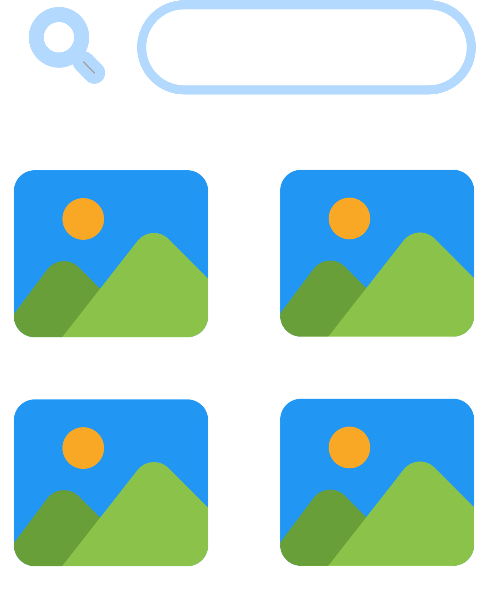
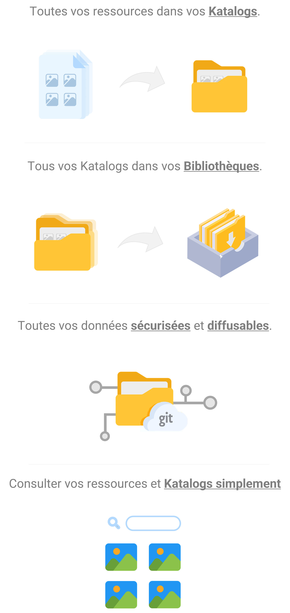
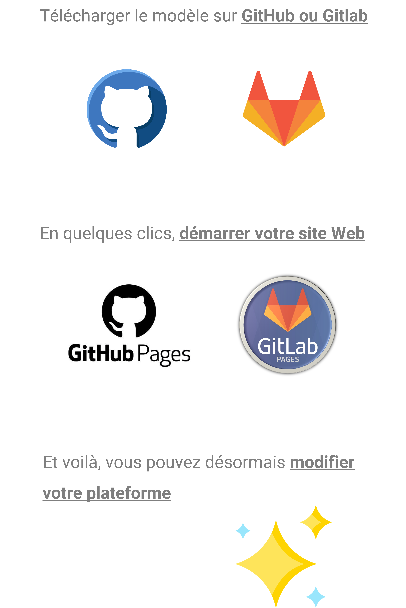

---
hide:
    - toc
    - navigation
---

     
    <h1>Bienvenue sur votre plateforme Katalog</h1>
    

    
Accèdez à vos <b>bibliothèques de ressources</b> et à vos <b>espaces de stockages</b>.

    

        <a href="./biblioteks/home" class="add-card">
            

                
            

        </a>
        <a href="./stockages/home" class="add-card">
            

                
            

        </a>  
         
    

    
    

 Mieux comprendre

    

        <h2 style="color:#A5A5A5">Katalog, <b>Kesako ?</b></h2>
          
        

          
        

         
        <h2 style="color:#A5A5A5">Katalog, <b>Pourquoi ?</b></h2>
          
        

        

         
        <h2 style="color:#A5A5A5">Katalog, <b>Comment ?</b></h2>
          
        

    
    

    

<head>
    <meta charset="utf-8">
    <!--<meta http-equiv="X-UA-Compatible" content="IE=edge">  Cette balise est faite pour adapter Internet Explorer, mais elle semble désuette en 2022-->
    <!--<meta name="description" content="csv to datatables to csv">-->
    <meta name="viewport" content="width=device-width, initial-scale=1">
    <!-- Custom CSS -->
    <link type="text/css" rel="stylesheet" href="https://cdn.datatables.net/1.10.22/css/jquery.dataTables.min.css">
    <link type="text/css" rel="stylesheet" href="https://cdn.datatables.net/buttons/1.6.4/css/buttons.dataTables.min.css">  
    <!-- Custom JS -->
    
    
    
    
        
    
    
    <!-- Personnal Konsilion CSS -->
    <link rel="stylesheet" href="https://konsilion.github.io/katalog-setup/css/CleanBody.css">
    <link rel="stylesheet" href="https://konsilion.github.io/katalog-setup/css/GridCard.css">
    <link rel="stylesheet" href="https://konsilion.github.io/katalog-setup/css/Form.css">
    <link rel="stylesheet" href="https://konsilion.github.io/katalog-setup/css/NeumorphismElem.css">  
    <link rel="stylesheet" href="https://konsilion.github.io/katalog-setup/css/Katalog.css">
    <link rel="stylesheet" href="https://konsilion.github.io/katalog-setup/css/BootstrapTable.css">    
    <!-- Personnal Konsilion JS -->
    
    
</head>

