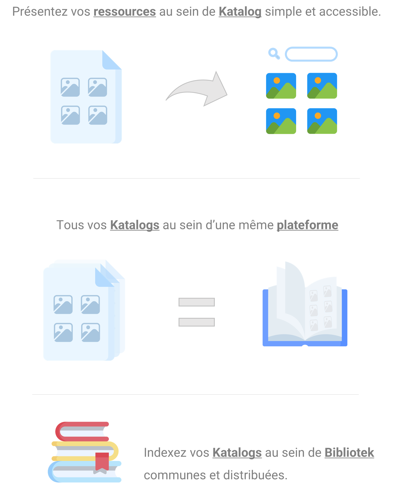

---
hide:
  - navigation
  - toc
---

<head>
    <link rel="stylesheet" href="https://konsilion.github.io/katalog-setup/css/CleanBody.css"/>
    <link rel="stylesheet" href="https://konsilion.github.io/katalog-setup/css/NeumorphismElem.css"/>
</head>

    <h1 style="color:#333; font-size: 60px; margin-bottom:25px;"><b>Katalog</b> - Nos projets <u>en communs</u>.</h1>
    
Accédez et participez au <b>développement de la science ouverte</b>.

     
    

         
        <a style="margin-bottom:25px;" class="md-button md-button--primary" href="./bibliotek/home">Ressources de développement</a>
        <a style="margin-bottom:25px;" class="md-button" href="./communaute/premiers-pas">Prise en main</a>
        <a style="margin-bottom:0px;" class="md-button" href="https://konsilion.fr">Site de Konsilion</a> 
    

    

    <h2>Comment créer <b>votre propre plateforme Katalog</b> ?</h2>

    <i>Un tutoriel détaillé sera bientôt mis à disposition, affaire à suivre.</i>
      
    <a class="md-button md-button--primary" href="https://konsilion.fr/wp/contacts/" target="_blank"><i class="fa-solid fa-envelope"></i>Une plateforme Katalog sur mesure ?</a>
      

 
    <h2 id="recherche-collaborative">Pour une <b>Recherche & Développement</b> libre et collaborative</h2>
 
    Voici <u>quatres grands principes</u> nécessaires à la réalisation de projets collaboratifs.   
    <ul>
        <li><b>Open community</b> : La communauté est du fait de la notion de collaboration, un pilier centrale. Incontournable, elle apporte soutient et intéligence collective, que nous pensons favorite face à la course à l'Inteligence Artificielle.</li>
        <li><b>Open data</b> : Les donnnées en libre accès sont essentielless pour alimenter les modèlisations, analyser leur pertinence et valider les hypothèses.</li>
        <li><b>Open model</b> : Les modèles numériques sont développés afin d'anticiper une technique, un comportement et ses effets dans le "vrai monde". Ainsi déployés, les modèles permettent de corriger les écarts en comparant avec les mesures et résultats de prototypes.</li>
        <li><b>Open doc</b> : La documentation permet de traverser les âges et de pérenniser un projet. Utile à la médiation et pouvant être utilisée pour la formation, une documentation de qualité est essentielle pour qu'un projet soit constructif et transmissible.</li>
    </ul> 

   

     
    
<a class="md-button" href="https://konnect.konsilion.fr/" target="_blank">Retrouvez-les dans Konnect</a>

     

